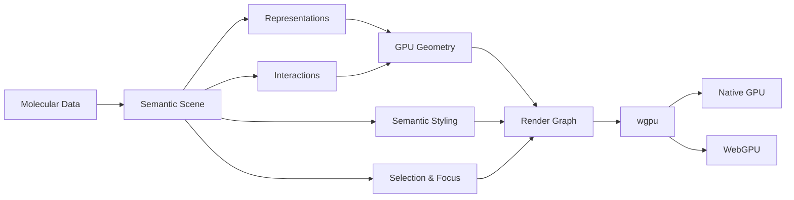

<div align="center">

# MolGFX

**Semantic, GPU-native molecular graphics for Rust, Python, and the web.**

Build interactive molecular scenes from atoms and bonds to cartoons, surfaces, interactions, volumes, and scientific context.

[](#license)
[](https://www.rust-lang.org/)
[](https://wgpu.rs/)
[](https://www.w3.org/TR/webgpu/)

</div>

---

MolGFX is an embeddable molecular graphics engine built for scientific applications.

It turns structured molecular data into interactive GPU-native scenes and provides the rendering infrastructure for atoms, bonds, molecular cartoons, surfaces, density, interactions, annotations, and scientifically meaningful visual composition.

MolGFX is a graphics engine rather than a molecular analysis package or end-user application.

Its responsibility is:

> **molecular data → semantic scene → GPU rendering**

## Why MolGFX?

A conventional molecular renderer can start with coordinates and ask:

> What geometry should I draw?

MolGFX is designed to support a more useful abstraction:

> What scientific information should this scene communicate?

A ligand is not merely another group of spheres.  
A binding site is not merely a list of residue indices.  
A hydrogen bond is not merely a dashed line.  
A confidence value is not merely a color.

These concepts have meaning that can influence representation, visibility, emphasis, interaction, and level of detail.

MolGFX keeps that meaning in the scene rather than reducing everything immediately to graphics primitives.

- **Semantic scene graph** — molecular and scientific concepts remain identifiable after entering the renderer.
- **GPU-native representations** — atoms, bonds, cartoons, surfaces, and volumes are designed around modern GPU execution.
- **Native and WebGPU** — one rendering architecture for desktop and browser targets.
- **Focus + context** — emphasize the scientifically relevant region without discarding surrounding structure.
- **Scientific interactions** — measurements and molecular interactions exist as structured scene objects.
- **Progressive visual quality** — interactive and high-quality rendering operate over the same scene.
- **Semantic level of detail** — representation can change with scale while preserving molecular organization.
- **Embeddable architecture** — build custom viewers, scientific applications, notebooks, dashboards, and visualization systems around the engine.

## Status

> **MolGFX is pre-1.0 and under active development.**

The rendering architecture and public contracts are being implemented and validated incrementally. APIs may change before the first stable release.


## Rendering model



The scene graph forms the boundary between molecular meaning and GPU implementation.

Applications describe molecular scenes.

The renderer decides how to efficiently turn those scenes into pixels.

## Quick start

The intended high-level Rust API operates in terms of molecular representations rather than GPU commands:

```rust
use molgfx::{
    Camera,
    Engine,
    Molecule,
    Representation,
    Select,
};

fn main() -> Result<(), Box<dyn std::error::Error>> {
    let molecule = Molecule::load("1abc.cif")?;

    let mut engine = Engine::new()?;
    let mut scene = engine.scene();

    scene.add(&molecule);

    scene.represent(
        Select::polymer(),
        Representation::Cartoon,
    );

    scene.represent(
        Select::ligands(),
        Representation::BallAndStick,
    );

    scene.focus(Select::ligands());

    let frame = engine.render(
        &scene,
        &Camera::default(),
    )?;

    frame.save("structure.png")?;

    Ok(())
}
```

> The exact API remains pre-1.0. This example represents the intended abstraction level rather than a stable compatibility contract.

MolGFX also exposes lower-level APIs for applications that need explicit control over scenes, rendering passes, resources, and GPU behavior.

## Semantic scenes

The scene graph represents scientific identity separately from visual representation.

Conceptually:

```text
Scene
├── Molecules
│   ├── Polymers
│   ├── Ligands
│   ├── Waters
│   └── Ions
│
├── Secondary Structure
├── Binding Sites
├── Interactions
├── Surfaces
├── Volumes
├── Measurements
├── Confidence
└── Annotations
```

A ligand therefore remains a ligand whether the current representation is:

```text
ball-and-stick
space filling
outline
transparent
hidden
highlighted
```

Rendering state changes.

Scientific identity does not.

This separation enables higher-level visualization behavior without encoding molecular meaning into low-level draw commands.

## Representations

MolGFX targets the core visual representations expected from a modern molecular graphics engine.

### Atoms and bonds

Supported representation families include:

```text
space filling
ball-and-stick
sticks
lines
points
```

Atoms and bonds are designed around analytic GPU primitives rather than dense sphere and cylinder meshes where possible.

An atom can be represented by a compact impostor whose exact sphere intersection is evaluated by the fragment shader.

A bond can similarly be represented as an analytic capsule or cylinder-like primitive.

This provides smooth silhouettes without requiring high tessellation density.

## Molecular cartoons

Protein cartoons communicate secondary structure more effectively than atomistic representations at many scales.

MolGFX's cartoon pipeline is designed around the molecular backbone and smooth transported coordinate frames.

Distinct profiles can represent:

- α-helices;
- β-sheets;
- coils;
- turns.

Geometry can be generated from structural control points rather than requiring applications to precompute display meshes.

## Molecular surfaces

Surface rendering supports spatial context that cannot always be communicated effectively through atoms alone.

Target representations include:

```text
solvent-accessible surface
solvent-excluded surface
local molecular surface
pocket surface
scalar-field-colored surface
```

Surface data can participate in the same scene as atomistic and cartoon representations.

A local pocket surface, for example, does not require constructing a separate visualization environment.

## Volumetric data

MolGFX's rendering architecture accommodates three-dimensional scalar fields.

Relevant scientific data includes:

- cryo-EM density;
- electron density;
- electrostatic fields;
- arbitrary volumetric scientific data.

Volumes can coexist with molecular geometry in the same camera, depth, clipping, and interaction model.

## Focus + context

A molecular scene may contain hundreds of thousands or millions of atoms while the current scientific question concerns only a small region.

Simply hiding everything outside that region loses useful context.

MolGFX is designed around **focus + context**.

For example, when focusing on a ligand, a scene may choose to:

```text
emphasize the ligand
reveal nearby residues
show relevant interactions
display a local surface
reduce distant structural detail
retain the global protein as subdued context
```

The result remains one scene.

Focus changes its composition rather than constructing an unrelated visualization from scratch.

## Semantic styling

Visual appearance can be driven by scientific properties.

Examples include:

```text
element
residue identity
chain
secondary structure
charge
hydrophobicity
distance
confidence
interaction type
selection state
arbitrary scalar values
```

These values can affect:

```text
color
opacity
material
visibility
emphasis
representation
level of detail
```

without changing the identity of the underlying scene object.

## Molecular interactions

Scientific interactions are represented as structured scene data rather than anonymous graphics primitives.

Potential interaction types include:

```text
hydrogen bonds
ionic interactions
hydrophobic contacts
π interactions
metal coordination
distance measurements
angles
dihedrals
```

Structured interactions can be:

- rendered;
- selected;
- inspected;
- styled;
- filtered;
- labeled;
- connected to application UI.

The renderer does not require that every interaction be computed internally. Applications may supply derived scientific information alongside molecular structure.

## Selection and picking

Interactive visualization requires a consistent mapping from pixels back to scientific objects.

MolGFX's picking architecture is designed so that rendered geometry can resolve back to objects such as:

```text
atom
bond
residue
chain
ligand
surface
interaction
annotation
```

Selection therefore operates at molecular rather than merely geometric granularity.

The same selection model can drive highlighting, representations, focus, inspection, and application actions.

## Real-time rendering

The interactive rendering path prioritizes low latency during:

- camera movement;
- selection;
- hover;
- picking;
- trajectory playback;
- representation changes;
- clipping;
- interactive analysis.

The architecture minimizes unnecessary CPU-side reconstruction and synchronization.

Key techniques include:

```text
analytic impostors
GPU geometry generation
batched submission
buffer reuse
instance rendering
explicit render passes
semantic LOD
minimal CPU ↔ GPU synchronization
```

## Progressive quality

Interactive and publication-oriented rendering have different performance constraints.

MolGFX is designed so a scene can transition from a responsive interactive path to progressively higher visual quality when interaction stops.

Potential quality improvements include:

- higher-quality ambient occlusion;
- soft shadows;
- improved transparency;
- anti-aliasing;
- higher sampling quality;
- improved surface shading.

Both rendering modes operate over the same scene.

No separate publication renderer is required.

## Semantic level of detail

Traditional level-of-detail systems primarily simplify geometry.

Molecular visualization can use the hierarchy of the science itself.

Conceptually:

```text
atoms
  ↓
residues
  ↓
secondary structure
  ↓
domains
  ↓
whole molecule
```

At close range, individual atoms may matter.

At large distances, showing those atoms independently becomes both expensive and visually meaningless.

MolGFX can use semantic information together with screen-space criteria to determine an appropriate representation for the current scale.

## Native and web

MolGFX is designed around `wgpu`, allowing a shared renderer architecture across native graphics APIs and WebGPU.

```text
                   MolGFX
                     │
               semantic scene
                     │
                    wgpu
              ┌──────┴──────┐
              │             │
            Native        WebGPU
              │             │
        Vulkan/Metal/    Browser
         DX12/etc.       + WASM
```

Browser portability is an architectural requirement rather than a later compatibility layer.

Portable crates avoid assumptions that would make the scene and rendering infrastructure native-only.

## Data model boundary

MolGFX does not need to own molecular file formats in order to render molecular information.

The renderer operates on structured molecular data containing the information required for visualization, such as:

```text
coordinates
elements
bonds
residue membership
chain membership
secondary structure
structural annotations
optional scientific properties
```

Adapters can translate compatible molecular representations into MolGFX scene data.

Once inside the renderer, those inputs become semantic scene objects rather than format-specific parser structures.

This keeps rendering independent from how molecular data was originally produced.

## GPU architecture

Rendering is split into layers with explicit responsibilities.

```text
scene
  │
  ▼
representation resolution
  │
  ▼
geometry preparation
  │
  ▼
GPU resources
  │
  ▼
render graph
  │
  ▼
passes
  │
  ▼
shaders
  │
  ▼
frame
```

The renderer can therefore evolve individual representation and backend implementations without changing the high-level molecular API.

## Render graph

Complex molecular scenes require multiple rendering stages.

A frame may involve passes for:

```text
depth
opaque geometry
surfaces
transparency
volumes
outlines
annotations
picking
post-processing
```

MolGFX models these explicitly rather than accumulating rendering behavior inside one monolithic draw loop.

The render graph defines dependencies between passes and their GPU resources.

## Shader architecture

Shaders are treated as engine code.

The shader layer is designed around:

- shared WGSL infrastructure;
- typed resource layouts;
- explicit pipeline contracts;
- shader validation;
- reusable molecular primitives;
- backend portability.

Shader behavior is tested and versioned with the rest of the renderer rather than maintained as opaque strings inside application code.

## Python

MolGFX is designed to expose a thin Python binding over the native engine.

The intended interaction is high-level:

```python
import molgfx

viewer = molgfx.Viewer()

molecule = viewer.load("1abc.cif")

molecule.polymer.cartoon()
molecule.ligands.ball_and_stick()

viewer.focus(molecule.ligands)
viewer.show()
```

The Python layer should orchestrate the engine rather than reimplement GPU or molecular rendering algorithms in Python.

The API remains pre-1.0 and may evolve as the core rendering contracts stabilize.

## Web

The WebAssembly interface targets browser-native molecular graphics through WebGPU.

A web application should be able to use the same fundamental concepts:

```text
scene
representation
selection
camera
materials
interaction
rendering
```

without requiring a separate JavaScript rendering engine.

Browser-specific integration remains at the platform boundary while the molecular scene and renderer stay shared.

## Visual correctness

A renderer being fast does not imply that it is correct.

MolGFX uses several layers of validation:

```text
unit tests
property tests
shader validation
golden scenes
perceptual image comparison
GPU capability tests
cross-platform checks
```

Golden scenes provide controlled examples whose expected output can be compared against later renderer revisions.

Perceptual comparison catches visual regressions that ordinary unit tests cannot observe.

Implementation and validation coverage are tracked separately.

## Performance

MolGFX aims to avoid unnecessary work before optimizing individual instructions.

The architecture emphasizes:

- compact molecular representations;
- GPU-generated geometry;
- analytic primitives;
- resource reuse;
- instancing;
- efficient buffer updates;
- batched command submission;
- explicit render passes;
- semantic level of detail;
- minimal synchronization.

Benchmarks cover CPU-side scene preparation and rendering-related workloads.

Performance measurements should always identify:

```text
hardware
graphics backend
scene
resolution
software revision
quality configuration
```

rather than presenting context-free FPS numbers.

## Scope

MolGFX owns molecular graphics.

It does not attempt to become:

- a molecular dynamics engine;
- a docking engine;
- a force-field implementation;
- a protein-structure predictor;
- a general-purpose molecular analysis library;
- a workflow application.

Keeping that boundary narrow makes the engine usable inside many kinds of scientific software.

Examples include:

```text
molecular viewers
desktop scientific applications
browser applications
Jupyter environments
docking interfaces
simulation viewers
model inspection tools
scientific dashboards
publication pipelines
custom research software
```

## Roadmap

Development is organized around progressively more complete rendering capabilities.

Major areas include:

1. atom and bond rendering;
2. camera and interaction infrastructure;
3. molecular cartoons;
4. picking and selection;
5. semantic scene infrastructure;
6. surfaces;
7. scientific interactions;
8. browser portability;
9. Python bindings;
10. progressive rendering;
11. volumetric data;
12. visual regression and performance validation.


## Development

Build the workspace:

```bash
cargo build --workspace
```

Run tests:

```bash
cargo test --workspace
```

Rendering changes should include appropriate behavioral and visual validation.

Architectural and contribution guidelines live in:

- [`AGENTS.md`](AGENTS.md)
- [`RULES.md`](RULES.md)
- [`docs/`](docs/)

## License

MolGFX is dual-licensed under either:

- MIT License, or
- Apache License 2.0,

at your option.
