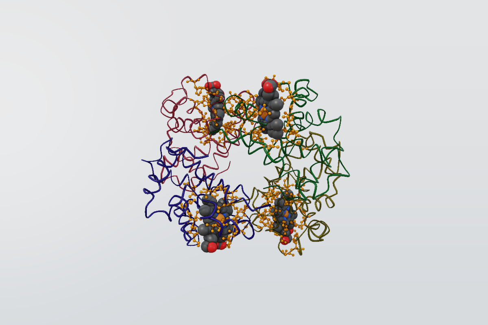

# MolGFX

[Documentation](https://miguelcsx.github.io/molgfx/)

MolGFX is a semantic molecular-rendering library for Python, Rust, and WebGPU.
It renders structures supplied by [MolFrame](https://github.com/miguelcsx/molframe)
as interactive browser scenes or deterministic native images. MolGFX does not
parse, fetch, dock, simulate, or open an application window.



## Install

macOS builds include native Metal and Vulkan portability. For repeatable headless
images on virtual machines, install a software Vulkan adapter and select it with
`WGPU_BACKEND=vulkan` and `VK_DRIVER_FILES`. Byte-exact rendering is checked on an
explicit reference adapter; Apple's hosted paravirtual Metal device produces
different pixels for repeated static exposures.

```bash
python -m pip install --upgrade molgfx
```

## Render a structure

```python
import molframe
import molgfx

# Infer bonds so atom-and-bond representations have sticks to draw.
structure = molframe.read("structure.cif").infer_bonds()
scene = molgfx.Scene(structure)
scene.add(molgfx.rep.cartoon(target=molgfx.sel.protein(), color=molgfx.color.chain()))
scene.add(molgfx.rep.ball_and_stick(target=molgfx.sel.ligands()))

molgfx.Renderer().render_image(scene, size=(1920, 1080)).save("structure.png")
```

Cartoon representations accept `aspect_ratio` (width divided by depth, default
`5.0`) and `arrow_factor` (terminal beta-arrow shoulder scale, default `1.5`).
Set `arrow_factor=0.0` to disable arrows. The Rust builder and browser scene
contract expose the same controls. `helix_profile` and `nucleic_profile` select
`"elliptical"`, `"rounded"` (planar faces with semicircular ends), or
`"square"` cross-sections (helix default: elliptical; nucleic default: square).
Rust uses `molgfx::rep::CartoonProfile`. Profiles change
the cross-section while preserving source guide coordinates and picking anchors.

Set `direction_wedges=True` on `molgfx.rep.cartoon(...)` to draw a flat
N-to-C direction triangle at each selected polymer guide (default: `False`).
The triangle's width and length are half the cartoon width. It follows live
source coordinates and picks the guide atom. A selection containing one guide
uses the direction of its source polymer; an isolated residue requires N/CA/C
(or C5'/C4'/C3' for nucleic acids). Missing direction atoms produce a render
error. Glycan cartoon mode rejects this control. Rust uses
`.direction_wedges(true)`; commands use `direction_wedges=true`.

Use `gaps="dashed"` on cartoon, backbone, trace, tube or putty to connect
missing polymer intervals with closed tubes of radius 0.15 Å and 0.5 Å
dashes separated by 0.5 Å. The default is `"hidden"`. Chain boundaries
and excluded residues remain disconnected. Connectors follow live coordinates
and retain source atom identity for picking. Rust uses
`.gaps(molgfx::rep::GapStyle::Dashed)`; commands use `gaps=dashed`.

Presentation effects are explicit values on a render profile:

```python
profile = molgfx.profile.converged().with_effect(molgfx.effect.bloom(intensity=0.8))
renderer = molgfx.Renderer(profile=profile)
```

`molgfx.effect` also provides depth cue, depth of field, motion blur, backdrop,
lighting, shape cues, display and anti-aliasing constructors. Invalid settings
raise an error before rendering. `without_effect(kind)` restores the quality
recipe's default for that kind. Rust exposes the same values under
`molgfx::profile`; WASM `Renderer.create` accepts an optional effects JSON array
of `{ "kind": ..., "settings": ... }` records validated by the shared core.

For native HDR export, retain scene-linear highlights in half-float OpenEXR:

```python
hdr = molgfx.Renderer(profile=molgfx.profile.converged()).render_hdr_image(scene, size=(1920, 1080))
hdr.save("structure.exr")
```

`HdrImage` exposes `width`, `height`, `exr_bytes()`, `rgba16f()` and
`quality_json()`. HDR capture completes the profile's exposure without baking
in bloom, exposure, tone mapping, display conversion or screen overlays.
Python `.save()` accepts only `.exr` filenames and raises `ValueError` before
writing any other format. Rust uses `HdrImage::save_exr` and also supports an
explicit camera through `Renderer::render_hdr_image_with_camera`.

A structure is optional for a scalar-volume scene. Bind voxel values separately
from the portable scene specification; the same grid can drive several
presentations without another upload:

```python
import hashlib
import struct
import molgfx

values = [
    max(0.0, 1.0 - ((x - 3.5) ** 2 + (y - 3.5) ** 2 + (z - 3.5) ** 2) ** 0.5 / 4.0)
    for z in range(8)
    for y in range(8)
    for x in range(8)
]
source = molgfx.data.source(hashlib.sha256(struct.pack("<512f", *values)).hexdigest())
scene = molgfx.Scene()
volume = molgfx.density.volume(source=source, dimensions=(8, 8, 8))
volume = volume.isosurface(0.5, color=(220, 40, 70)).direct(
    [
        (0.0, (50, 150, 255), 0.0),
        (1.0, (50, 150, 255), 0.4),
    ]
)
identity = scene.add(volume)
scene.bind_volume(identity, values)
molgfx.Renderer().render_image(scene, size=(640, 480)).save("density.png")
```

`values` are indexed with x fastest, then y, then z. For a map read by
MolFrame, supply its column-major `voxel_to_world` affine instead of assuming
unit voxels at the origin. Region bounds use half-open voxel indices.

Targets are MolFrame queries, and a small command language works around them
through `molgfx.Session`:

```text
show cartoon, protein
select pocket, byres (within 5 of resname HEM) and protein
show licorice, $pocket
color orange, $pocket
```

Named snapshots capture the complete authored scene (camera, styles, interaction
state, assemblies and overlays), not coordinates, pixels or renderer buffers:

```python
session.snapshot_save("overview")
session.execute("color orange, protein")
session.snapshot_restore("overview")
session.undo()  # Return to the state immediately before restoration.
session.snapshot_remove("overview")
```

The same operations are commands: `snapshot save|restore|remove NAME`. Named
captures round-trip in `Session.to_json()` and `Session.from_json(scene, json)`.
Restoration requires local bindings with matching content identities; missing or
mismatched assets leave the live scene unchanged. Revisions advance on restore
and undo rather than returning to the captured revision. Rust uses the canonical
`interop::SceneSnapshot`, `Scene::snapshot`, `Scene::restore_snapshot` and
`PatchOperation::RestoreSnapshot`. Frame export remains `render_sequence` or
`render_camera_path`; no retained movie request is an export implementation.

The Rust engine opens no window and owns no application panels. This repository
also supplies the official browser host: a canvas, navigation and semantic picks,
not a Workbench, console, toolbar or file picker. `Session` remains the sole
command and undo/redo authority. Python notebooks use this same frontend through
AnyWidget, a normal package dependency.

```python
session = molgfx.Session(structure)
session.execute("show cartoon, protein")
viewer = molgfx.Viewer(session)
viewer  # Display in Jupyter.
```

## Browser SDK

```bash
npm install molgfx
```

```typescript
import { Viewer } from "molgfx";
import "molgfx/viewer.css";

const viewer = await Viewer.create(document.getElementById("scene")!);
await viewer.load(await fetch("structure.cif").then(r => r.arrayBuffer()), { name: "structure.cif" });
viewer.execute("show cartoon, protein");
// On host teardown:
await viewer.dispose();
```

The one npm package exports `molgfx`, `molgfx/viewer`, `molgfx/anywidget` and
`molgfx/react`. The React adapter owns viewer mount/dispose, not molecular state.
Public TypeScript declarations never expose the raw wasm ABI.

```tsx
"use client";
import { MolGFXViewer } from "molgfx/react";
import "molgfx/viewer.css";

export function Protein({ bytes }: { bytes: Uint8Array }) {
  return <MolGFXViewer structure={bytes} name="protein.cif"
    style={{ width: "100%", height: 480 }}
    onError={error => console.error(error.message)} />;
}
```

Keep the input byte object stable between unchanged React renders. The adapter
reuses its Viewer for structure updates and disposes it on unmount; it does not
duplicate Scene, Session or rendering semantics.

## Shared frontend build

```bash
nix develop -c npm ci --prefix web
nix develop -c npm run build --prefix web
nix develop -c npm test --prefix web
nix develop -c npm pack ./web --pack-destination web
```

`web/scripts/build.mjs` runs wasm-pack into ignored `web/generated`, then emits
the official package into ignored `web/dist` and copies identical artifacts to
Python static assets. The documentation site imports the public npm package;
Next.js emits its WASM asset rather than loading a private runtime directory.
A content-hash manifest and archive-level checks prove that npm tarballs and
Python wheels carry identical runtime bytes. Build before running maturin from
a source checkout; PyPI source distributions include the prebuilt runtime and
need Python >=3.12, Rust and dependency fetching, but no Node, wasm-pack or
adjacent MolFrame checkout. Cargo, Python and npm versions must match.
Native wheel builds repair external libraries; release gates rebuild the source
archive and exercise fresh installed wheels before publication.

Python and npm have separate release workflows. Published versions are immutable;
release 0.4.1 supersedes the existing PyPI 0.4.0 package. npm trusted publishing
requires the package owner to authorize this repository and release workflow.
Until the first registry publication, the docs use the public package through a
local npm dependency, exercising the same exports and bundler asset resolution.

## Cross-engine gallery

The optional Mol* adapter runs the requested local Mol* source checkout in real
Chromium/WebGL2. Install its locked Node transport dependencies, then provide a
real Chromium executable and PyMOL binary:

```bash
nix develop -c npm ci --prefix crates/molgfx-bench/parity
MOLSTAR_CHROMIUM=/path/to/chrome nix develop -c cargo run -p molgfx-bench --bin parity -- \
  --manifest crates/molgfx-bench/parity/gallery.json --cache ~/.cache/molgfx-corpus \
  --output target/gallery --case P2-iso-solid-skewMRC \
  --recipe molgfx-converged --recipe pymol-ray --recipe molstar-imagepass \
  --molstar-root ../molstar --pymol /path/to/pymol
```

The manifest records explicit omissions for recipes that cannot faithfully
represent a case; failures are never counted as omissions. Review visual
semantics before blessing golden images.
Motion-blur orbit cases also require `--ffmpeg /path/to/ffmpeg`.

[Writing queries and commands](https://miguelcsx.github.io/molgfx/docs/commands/queries)
walks through both, and the
[MolFrame query reference](https://miguelcsx.github.io/molframe/docs/query-language/)
lists every keyword.

## Status

Beta. Public APIs are available through the `molgfx` facade; MolFrame provides
structure input and molecular selection semantics.

## License

[MIT](LICENSE)
